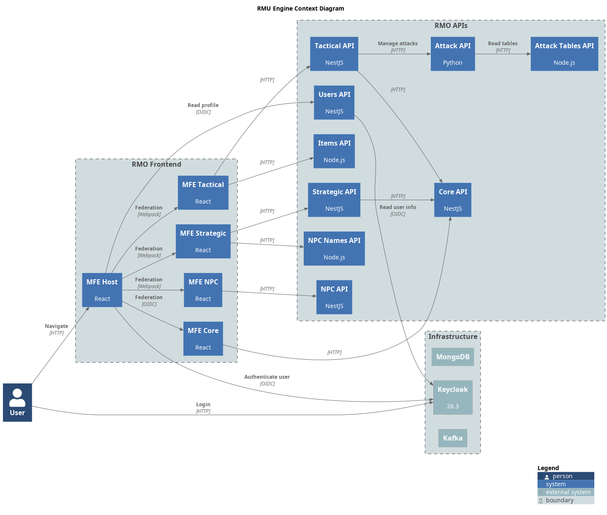

= RMU Engine Platform
:linkattrs:
:icons: font
:toc: left
:toclevels: 3

image:https://img.shields.io/badge/license-GPL3.0-green.svg[License,link="https://www.gnu.org/licenses/gpl-3.0.html"]
image:https://img.shields.io/badge/rolemaster-rmu-green.svg[Rolemaster,link="http://ironcrown.co.uk/unified-rolemaster/"]

++++

++++

RMU Online is a project that implements link:http://ironcrown.co.uk/unified-rolemaster/[Rolemaster Unified] through a distributed set of APIs, shared libraries, and micro-frontends.

This repository is the platform entry point. It documents the solution, links to the modules that compose it, and provides local orchestration assets for infrastructure, APIs, and supporting services.

WARNING: *This application is an independent fan project for Rolemaster Unified. It is not affiliated with, endorsed by, or licensed by Iron Crown Enterprises (ICE), the owners of the Rolemaster intellectual property.*
*All Rolemaster trademarks, game systems, and materials are the property of Iron Crown Enterprises. This software is provided for personal, non-commercial use only. If you enjoy Rolemaster, please support the official publications and content from ICE.*

== What This Repository Contains

The RMU Platform repository is intentionally informational and operational. The implementation of each bounded domain lives in its own repository, while this repository keeps the global view of the solution.

Main responsibilities:

* Link to each API, micro-frontend, and shared module.
* Describe the platform architecture and runtime dependencies.
* Provide Docker Compose files for local infrastructure and API execution.
* Keep deployment-oriented assets such as Kubernetes, Argo CD, Minikube, MongoDB backup, and AWS notes.
* Centralize diagrams and high-level documentation for contributors.

== Architecture Overview

*RMU Engine* is an online assistant for playing *Rolemaster Unified* games.

The application is divided into APIs developed in *NestJS*, *Python*, and *Express/Node.js*, along with micro-frontends developed in *React* using *Webpack Module Federation*. The shell handles authentication and shared application composition, while each MFE owns a specific domain such as core rules, strategic play, tactical play, items, NPCs, and spells.

The platform uses *MongoDB* for domain persistence, *Kafka* for event communication between services, and *Keycloak* as the OIDC identity and access management provider. Some local Compose profiles also include *PostgreSQL* for Keycloak storage and *Kafka UI* for event inspection.

== Modules

=== API Modules

[options="header"]
|===
|Module |Repository |Stack

|API Core
|link:https://github.com/labcabrera/rmu-api-core[]
|NestJS

|API Strategic
|link:https://github.com/labcabrera/rmu-api-strategic[]
|NestJS

|API Tactical
|link:https://github.com/labcabrera/rmu-api-tactical[]
|NestJS

|API Attack
|link:https://github.com/labcabrera/rmu-api-attack[]
|Python

|API Attack Tables
|link:https://github.com/labcabrera/rmu-api-attack-tables[]
|Node.js

|API Items
|link:https://github.com/labcabrera/rmu-api-items[]
|NestJS

|API Spells
|link:https://github.com/labcabrera/rmu-api-spells[]
|NestJS

|API NPCs
|link:https://github.com/labcabrera/rmu-api-npcs[]
|NestJS

|API NPC Names
|link:https://github.com/labcabrera/rmu-api-npc-names[]
|Node.js

|API Users
|link:https://github.com/labcabrera/rmu-api-users[]
|NestJS

|API Media
|link:https://github.com/labcabrera/rmu-api-media[]
|NestJS

|===

=== Micro-Frontend Modules

[options="header"]
|===
|Module |Repository |Stack

|MFE Shell
|link:https://github.com/labcabrera/rmu-mfe-shell[]
|React

|MFE Core
|link:https://github.com/labcabrera/rmu-mfe-core[]
|React

|MFE Strategic
|link:https://github.com/labcabrera/rmu-mfe-strategic[]
|React

|MFE Tactical
|link:https://github.com/labcabrera/rmu-mfe-tactical[]
|React

|MFE NPCs
|link:https://github.com/labcabrera/rmu-mfe-npcs[]
|React

|MFE Spells
|link:https://github.com/labcabrera/rmu-mfe-spells[]
|React

|React Shared Library
|link:https://github.com/labcabrera/rmu-react-shared-lib[]
|React

|MFE Assets
|link:https://github.com/labcabrera/rmu-mfe-assets[]
|Static assets
|===

== Resurces

* `docker-compose/`:  different Docker Compose configurations: base infrastructure only, infrastructure + APIs, infrastructure + APIs + Nginx.
* `terraform/`: Terraform scripts for AWS infrastructure provisioning and shared Keycloak configuration for local and AWS instances.
* `diagrams/`: Architecture diagrams and their source files.

To deploy the project locally on a local Kubernetes cluster, we have the following Minikube-based resources (_WIP_):

* `minikube/`: Helper scripts for running the platform on Minikube local Kubernetes
* `argocd/`: Argo CD application descriptors for GitOps deployment.
* `k8s/`: Kubernetes manifests for deployment on cloud or local clusters.

== Running Locally With Docker Compose

=== Prerequisites

Install the following tools before starting the platform locally:

* Docker Engine or Docker Desktop.
* Docker Compose v2.
* A local clone of this repository.
* Access to the Docker images referenced by the Compose files.

The Compose files expect an external Docker network named `rmu-network`.

[source,bash]
----
docker network create rmu-network
----

If the network already exists, Docker will report it and you can continue.

=== Environment

The local Compose setup reads variables from `docker-compose/.env`. The file contains development credentials and local-only defaults for MongoDB, PostgreSQL, Keycloak, Kafka UI, and OIDC integration.

=== Start Base Infrastructure

Use this option when you only need MongoDB, PostgreSQL, Keycloak, Kafka, and Kafka UI.

[source,bash]
----
docker compose --env-file docker-compose/.env -f docker-compose/docker-compose.yaml up -d
----

Useful local endpoints:

[options="header"]
|===
|Service |URL

|Keycloak
|link:http://localhost:8090[]

|Kafka UI
|link:http://localhost:8091[]

|MongoDB
|`mongodb://localhost:27017`
|===

==== Terraform Keycloak Setup

The same Terraform configuration manages the realm, groups, clients, and users in
either the local instance or the Keycloak instance deployed on AWS. For the local
instance, run:

[source,bash]
----
cd terraform/keycloak
cp environments/local.tfvars.example terraform.tfvars
terraform init
terraform plan
terraform apply
----

For AWS, first apply the infrastructure in `terraform/`, wait for the `auth`
endpoint to become available, and then use
`terraform/keycloak/environments/keycloak-aws.tfvars.example`. See
link:terraform/keycloak/README.adoc[] for both workflows and legacy state migration.

=== Start APIs

Use this option when you want to run the backend services from their published Docker images.

[source,bash]
----
docker compose --env-file docker-compose/.env -f docker-compose/docker-compose.yaml --profile apis up -d
----

The API Compose profile exposes services such as:

[options="header"]
|===
|Service |Local port

|Core API
|`3001`

|Strategic API
|`3002`

|Tactical API
|`3003`

|Attack Tables API
|`3005`

|Items API
|`3006`

|NPC Names API
|`3007`

|NPCs API
|`3008`

|Spells API
|`3009`

|Attack API
|`8000`
|===

=== Start APIs With Nginx

Use this option when you want the local API gateway in front of the services.

[source,bash]
----
docker compose --env-file docker-compose/.env -f docker-compose/docker-compose-nginx.yaml up -d
----

The Nginx profile exposes the gateway on `http://localhost` and routes paths such as `/core/`, `/strategic/`, `/tactical/`, `/attack/`, `/attack-tables/`, and `/items/` to the corresponding API containers.

=== Stop The Stack

[source,bash]
----
docker compose --env-file docker-compose/.env -f docker-compose/docker-compose-apis.yaml down
----

To remove persisted local data as well, add `-v` after confirming that you no longer need the local volumes.

=== Initialization Data Notice

WARNING: Some initialization data is intentionally not available in this public repository because it may contain copyrighted Rolemaster Unified material owned by Iron Crown Enterprises.

As a result, a fresh local environment may start successfully but lack part of the game reference content needed for complete functional usage. Contributors should use legally obtained materials only for personal testing and must not submit copyrighted data, tables, text, or derived protected content to this repository.

== API Collection

The Postman collection linked at the top of this README provides a convenient starting point for exploring the available APIs. Depending on the local profile and seed data available in your environment, some requests may require manual configuration of authentication tokens, base URLs, or test data.

== License

This project is distributed under the GPL-3.0 license. See link:LICENSE[] for details.
